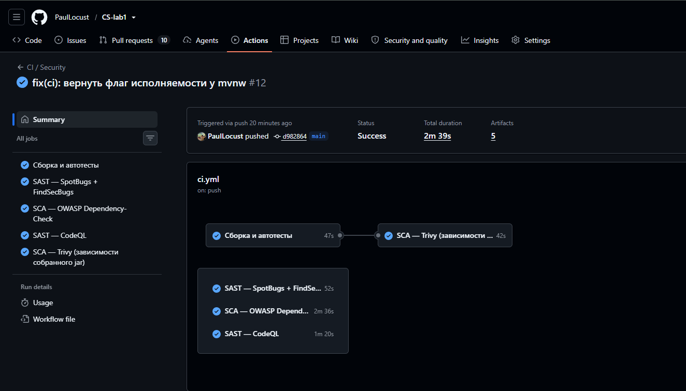
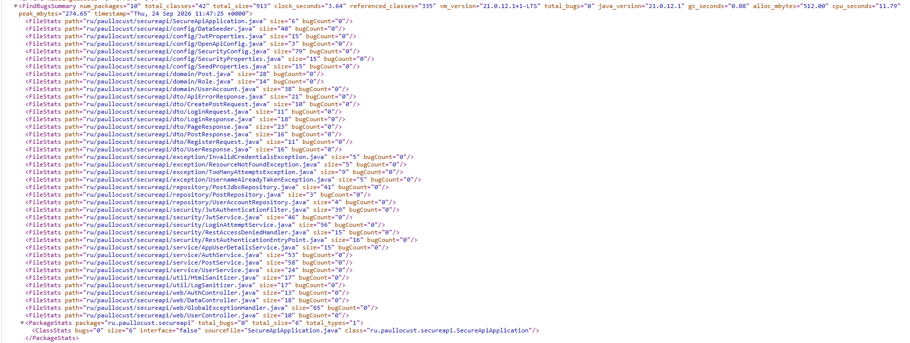
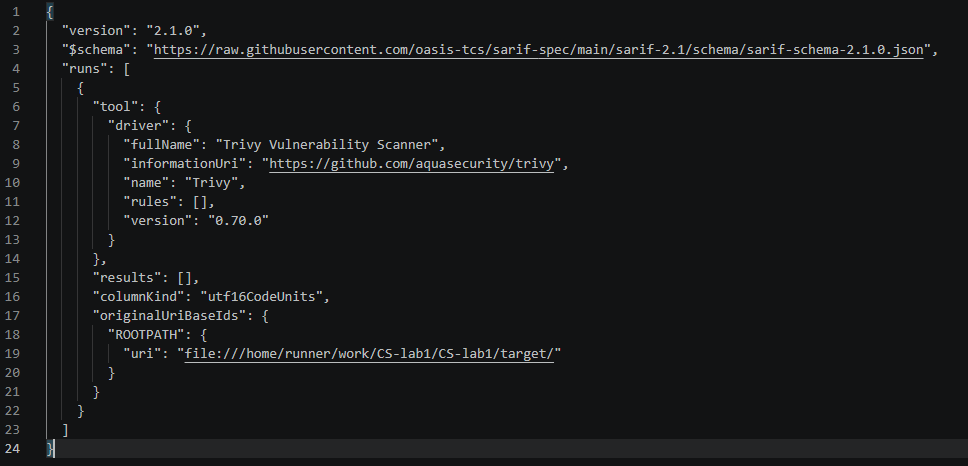
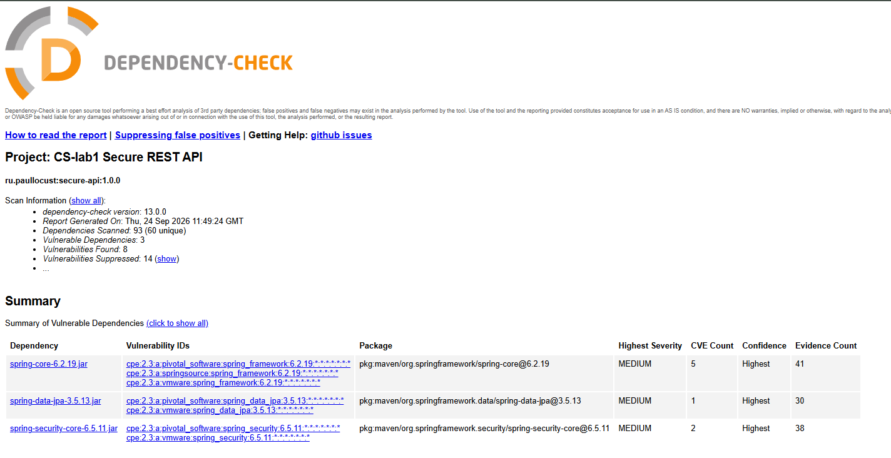
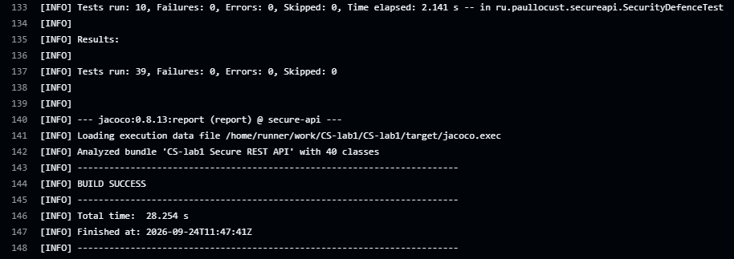
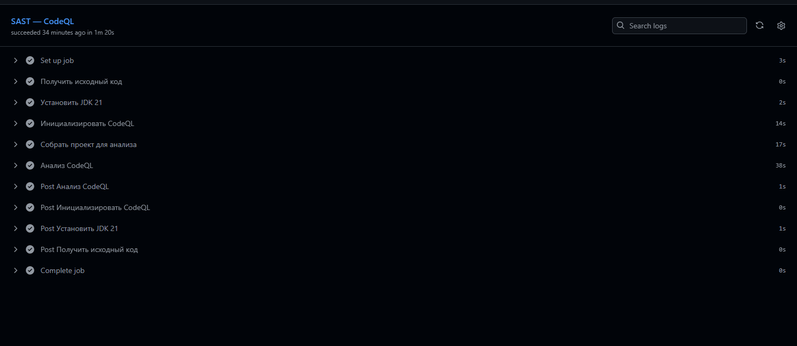

# CS-lab1 — Защищённый REST API с интеграцией в CI/CD

Лабораторная работа №1 по дисциплине «Информационная безопасность».

Учебный backend-сервис на **Java 21 / Spring Boot 3.5**, который демонстрирует практическую защиту
от рисков [OWASP Top 10 2021](https://owasp.org/www-project-top-ten/) — в первую очередь
**A01 Broken Access Control**, **A03 Injection** и **A07 Identification and Authentication Failures** —
и автоматическую проверку кода и зависимостей в GitHub Actions (SAST + SCA).

* **Репозиторий:** <https://github.com/PaulLocust/CS-lab1>
* **CI/CD pipeline:** <https://github.com/PaulLocust/CS-lab1/actions/workflows/ci.yml>
* **Последний успешный запуск:** см. раздел [Ссылка на успешный запуск pipeline](#ссылка-на-успешный-запуск-pipeline)

---

## Содержание

1. [Стек и структура проекта](#стек-и-структура-проекта)
2. [Быстрый старт](#быстрый-старт)
3. [Описание API](#описание-api)
4. [Реализованные меры защиты](#реализованные-меры-защиты)
   * [Защита от SQL-инъекций (A03)](#1-защита-от-sql-инъекций-a03-injection)
   * [Защита от XSS (A03)](#2-защита-от-xss-a03-injection)
   * [Аутентификация: JWT и BCrypt (A07)](#3-аутентификация-jwt--bcrypt-a07)
   * [Разграничение доступа (A01)](#4-разграничение-доступа-a01-broken-access-control)
   * [Дополнительные меры](#5-дополнительные-меры)
5. [Тестирование](#тестирование)
6. [CI/CD и security-сканеры](#cicd-и-security-сканеры)
7. [Что нашли сканеры и что мы сделали](#что-нашли-сканеры-и-что-мы-сделали)
8. [Скриншоты отчётов](#скриншоты-отчётов)
9. [Ответы на контрольные вопросы](#ответы-на-контрольные-вопросы)

---

## Стек и структура проекта

| Компонент | Выбор | Почему |
|---|---|---|
| Язык / сборка | Java 21, Maven (+ Maven Wrapper) | требование задания; wrapper позволяет собрать проект без установленного Maven |
| Фреймворк | Spring Boot 3.5.16, Spring Security 6 | промышленный стандарт, безопасные значения по умолчанию |
| БД | H2 (in-memory) + Spring Data JPA / Hibernate | учебный пример; ORM даёт параметризованные запросы «из коробки» |
| Аутентификация | JJWT 0.12.7 (HS256), BCrypt (cost 12) | подписанные stateless-токены, медленное хеширование паролей |
| Защита от XSS | Jsoup 1.23 (санитизация) + OWASP Java Encoder 1.3 (экранирование) | два независимых слоя: на входе и на выходе |
| SAST | SpotBugs 4.9 + FindSecBugs 1.14, CodeQL | статический анализ байт-кода с правилами безопасности |
| SCA | Trivy, OWASP Dependency-Check 13, Dependabot | поиск известных CVE в зависимостях |
| Документация API | springdoc-openapi (Swagger UI) | интерактивная проверка эндпоинтов |

```
CS-lab1/
├── .github/
│   ├── workflows/ci.yml            # пайплайн: сборка, тесты, SAST, SCA
│   └── dependabot.yml              # еженедельные обновления зависимостей
├── config/
│   ├── spotbugs-exclude.xml        # разобранные ложные срабатывания SAST
│   └── dependency-check-suppressions.xml
├── docs/
│   ├── api-examples.md             # примеры curl-запросов с ответами
│   └── screenshots/                # скриншоты отчётов SAST/SCA
├── postman/CS-lab1.postman_collection.json
├── scripts/
│   ├── smoke-test.sh               # проверка API через curl
│   └── smoke-test.ps1              # то же для Windows PowerShell
└── src/main/java/ru/paullocust/secureapi/
    ├── config/          # SecurityConfig, свойства, OpenAPI, сидер данных
    ├── domain/          # сущности JPA: UserAccount, Post, Role
    ├── dto/             # request/response-модели с Bean Validation
    ├── exception/       # доменные исключения
    ├── repository/      # Spring Data + пример JDBC PreparedStatement
    ├── security/        # JwtService, JWT-фильтр, 401/403-обработчики, rate limiter
    ├── service/         # AuthService, PostService, UserService
    ├── util/            # HtmlSanitizer, LogSanitizer
    └── web/             # контроллеры и глобальный обработчик ошибок
```

---

## Быстрый старт

```bash
git clone https://github.com/PaulLocust/CS-lab1.git
cd CS-lab1
./mvnw spring-boot:run          # Windows: .\mvnw.cmd spring-boot:run
```

Приложение поднимется на <http://localhost:8080>.

| Ресурс | Адрес |
|---|---|
| Swagger UI | <http://localhost:8080/swagger-ui.html> |
| OpenAPI-описание | <http://localhost:8080/v3/api-docs> |
| Health check | <http://localhost:8080/actuator/health> |

Демонстрационные учётные записи (пароли задаются свойствами `app.seed.*`, в БД хранятся только BCrypt-хеши):

| Логин | Пароль | Роль |
|---|---|---|
| `admin` | `Admin#Str0ng-2026` | ADMIN |
| `alice` | `Alice#Str0ng-2026` | USER |

Полезные команды:

```bash
./mvnw test                       # 39 автотестов
./mvnw verify                     # тесты + SAST (SpotBugs + FindSecBugs)
./mvnw -Psecurity-scan verify     # + SCA (OWASP Dependency-Check)
bash scripts/smoke-test.sh        # ручная проверка API через curl
```

**Переменные окружения для продового запуска** (профиль `prod` не имеет значений по умолчанию —
приложение не стартует без секретов):

```bash
export APP_JWT_SECRET='...не менее 32 символов, из менеджера секретов...'
export APP_SEED_ADMIN_PASSWORD='...'
export APP_SEED_USER_PASSWORD='...'
java -jar target/secure-api-1.0.0.jar --spring.profiles.active=prod
```

---

## Описание API

Три обязательных метода по заданию — `POST /auth/login`, `GET /api/data` и придуманный самостоятельно
`POST /api/data`; остальные добавлены, чтобы показать разграничение прав и работу с профилем.

| # | Метод | Эндпоинт | Доступ | Назначение |
|---|---|---|---|---|
| 1 | `POST` | `/auth/login` | публичный | аутентификация, выдача JWT |
| 2 | `GET` | `/api/data` | JWT | постраничный список записей |
| 3 | `POST` | `/api/data` | JWT | **свой метод:** создание записи с очисткой ввода от HTML |
| 4 | `GET` | `/api/data/search?query=` | JWT | поиск через JDBC PreparedStatement |
| 5 | `DELETE` | `/api/data/{id}` | JWT, автор или ADMIN | удаление записи с проверкой владельца |
| 6 | `GET` | `/api/me` | JWT | профиль владельца токена |
| 7 | `GET` | `/api/users` | JWT + роль ADMIN | список пользователей |
| 8 | `POST` | `/auth/register` | публичный | регистрация (BCrypt + парольная политика) |

### 1. `POST /auth/login`

```bash
curl -X POST http://localhost:8080/auth/login \
  -H 'Content-Type: application/json' \
  -d '{"username":"alice","password":"Alice#Str0ng-2026"}'
```

```json
{
  "accessToken": "eyJhbGciOiJIUzI1NiJ9.eyJqdGkiOiI5MGJlZTFkZC04ODA5...",
  "tokenType": "Bearer",
  "expiresInSeconds": 900,
  "username": "alice",
  "roles": ["ROLE_USER"]
}
```

Неверная пара логин/пароль → `401` с обезличенным сообщением; 5 неудачных попыток подряд →
`429 Too Many Requests` с заголовком `Retry-After` (см. раздел про защиту от перебора).

### 2. `GET /api/data`

```bash
curl "http://localhost:8080/api/data?page=0&size=3" -H "Authorization: Bearer $TOKEN"
```

```json
{
  "items": [
    {
      "id": 1,
      "title": "OWASP Top 10 2021",
      "content": "A01 Broken Access Control, A03 Injection и A07 ... разбираются в этой лабораторной работе.",
      "author": "admin",
      "createdAt": "2026-09-10T16:53:41.593659Z"
    }
  ],
  "page": 0, "size": 3, "totalItems": 3, "totalPages": 1
}
```

Без заголовка `Authorization` — `401`:

```json
{
  "timestamp": "2026-09-10T16:50:39.531770300Z",
  "status": 401,
  "error": "unauthorized",
  "message": "Требуется действительный access-токен: заголовок 'Authorization: Bearer <token>'",
  "path": "/api/data"
}
```

### 3. `POST /api/data` (собственный метод)

```bash
curl -X POST http://localhost:8080/api/data \
  -H "Authorization: Bearer $TOKEN" -H 'Content-Type: application/json' \
  -d '{"title":"XSS <script>alert(1)</script>","content":" plain text & symbols"}'
```

```json
{
  "id": 5,
  "title": "XSS",
  "content": "text and &amp; symbol",
  "author": "alice",
  "createdAt": "2026-09-10T16:50:55.722616200Z"
}
```

Скрипт и обработчик события вырезаны при сохранении, `&` отдан в виде HTML-сущности.
Автор берётся из токена, а не из тела запроса.

Полный список примеров с реальными ответами — в [docs/api-examples.md](docs/api-examples.md),
готовая коллекция для Postman — в [postman/CS-lab1.postman_collection.json](postman/CS-lab1.postman_collection.json).

---

## Реализованные меры защиты

### 1. Защита от SQL-инъекций (A03: Injection)

Конкатенация пользовательских данных с текстом SQL в проекте отсутствует. Используются два подхода:

**а) ORM (Hibernate) через Spring Data.** Запросы описаны либо именами методов, либо JPQL
с именованными параметрами — [`PostRepository`](src/main/java/ru/paullocust/secureapi/repository/PostRepository.java):

```java
@Query("""
        SELECT p FROM Post p
         WHERE LOWER(p.title) LIKE LOWER(CONCAT('%', :query, '%'))
            OR LOWER(p.content) LIKE LOWER(CONCAT('%', :query, '%'))
        """)
Page<Post> search(@Param("query") String query, Pageable pageable);
```

**б) Явный `PreparedStatement`** — [`PostJdbcRepository`](src/main/java/ru/paullocust/secureapi/repository/PostJdbcRepository.java).
SQL объявлен константой, значения передаются отдельно как параметры `?`:

```java
private static final String SEARCH_SQL = """
        SELECT id, title, content, author_username, created_at
          FROM posts
         WHERE LOWER(title) LIKE LOWER(?) ESCAPE '\\'
            OR LOWER(content) LIKE LOWER(?) ESCAPE '\\'
         ORDER BY created_at DESC
         LIMIT ?
        """;

jdbcTemplate.query(SEARCH_SQL, ROW_MAPPER, pattern, pattern, limit);
```

Драйвер отправляет текст запроса и данные раздельно, поэтому кавычка внутри параметра остаётся
обычным символом и не может «закрыть» строковый литерал. Дополнительно экранируются служебные
символы `LIKE` (`%`, `_`, `\`), иначе ввод `%` превратился бы в «выбрать всё».

Дополнительные слои: строгая валидация входа (логин — только `[A-Za-z0-9._-]{3,64}`), лимит на размер
страницы и числа результатов, отсутствие деталей ошибок БД в ответах.

**Проверено:**

| Payload | Результат |
|---|---|
| `' OR '1'='1` в `/api/data/search` | `200`, пустой массив — строка искалась как текст |
| `x'; DROP TABLE posts; --` | `200`, таблица цела, `/api/data` продолжает отдавать данные |
| `admin'--` в логине | `400` — отсечён валидацией до обращения к БД |
| `' OR 1=1 --` в пароле | `401` — обхода аутентификации нет |

### 2. Защита от XSS (A03: Injection)

Реализованы **два независимых слоя** ([`HtmlSanitizer`](src/main/java/ru/paullocust/secureapi/util/HtmlSanitizer.java)):

1. **Санитизация на входе** — Jsoup с политикой `Safelist.none()` удаляет из данных любые теги
   и атрибуты (`<script>`, ``, `javascript:`), в БД попадает только текст.
   Это защита от **хранимого (stored) XSS**.
2. **Экранирование на выходе** — OWASP Java Encoder (`Encode.forHtml`) применяется ко всем строковым
   полям в ответах API, поэтому `&`, `<`, `>`, кавычки уходят клиенту как HTML-сущности даже если
   данные попали в базу мимо API.

```java
public String sanitize(String raw) {                       // вход
    String withoutMarkup = Jsoup.clean(raw, "", Safelist.none(), OUTPUT_SETTINGS);
    return Parser.unescapeEntities(withoutMarkup, false).trim();
}

public String encodeForHtml(String value) {                // выход
    return Encode.forHtml(value);
}
```

Сопутствующие меры: ответы отдаются с `Content-Type: application/json` и заголовком
`X-Content-Type-Options: nosniff` (браузер не станет угадывать тип и выполнять ответ как HTML),
а Content-Security-Policy для API — `default-src 'none'; sandbox`.

**Проверено:**

| Ввод | Что сохранилось и вернулось |
|---|---|
| `XSS <script>alert('pwned')</script> Проверка` | `XSS  Проверка` |
| ` Обычный текст & спецсимволы` | `Обычный текст &amp; спецсимволы` |
| `<a href="javascript:alert(1)">клик</a>` | `клик` |
| `<svg/onload=alert(1)>`, `<iframe src=...>` | пустая строка → запрос отклоняется с `400` |

### 3. Аутентификация: JWT + BCrypt (A07)

**Хеширование паролей.** `BCryptPasswordEncoder` с версией `$2b` и стоимостью **12**
([`SecurityConfig`](src/main/java/ru/paullocust/secureapi/config/SecurityConfig.java)).
Открытый пароль не сохраняется, не логируется и не возвращается в API; `toString()` у DTO логина
переопределён так, чтобы пароль не попал в логи при отладке. В БД лежит строка вида
`$2b$12$Xk9...` — соль генерируется автоматически и хранится внутри хеша.

**Выдача токена.** После успешной проверки пары логин/пароль
[`JwtService`](src/main/java/ru/paullocust/secureapi/security/JwtService.java) выпускает JWT,
подписанный **HS256**:

```json
{ "alg": "HS256" }
{
  "jti": "90bee1dd-8809-4b6c-89cf-66d3ee07b030",
  "sub": "alice",
  "iss": "cs-lab1-secure-api",
  "aud": ["cs-lab1-clients"],
  "iat": 1789059038, "nbf": 1789059038, "exp": 1789059938,
  "roles": ["ROLE_USER"]
}
```

Время жизни — 15 минут (`app.jwt.access-token-ttl`), секрет читается из `APP_JWT_SECRET`
и обязан быть не короче 32 символов (256 бит для HS256) — иначе приложение не стартует.

**Middleware проверки токена.**
[`JwtAuthenticationFilter`](src/main/java/ru/paullocust/secureapi/security/JwtAuthenticationFilter.java)
выполняется один раз на каждый запрос: достаёт токен **только** из заголовка `Authorization: Bearer`,
проверяет подпись и claim-ы и кладёт аутентификацию в `SecurityContext`. Проверяются:

* HMAC-подпись (алгоритм задан явно — атаки `alg: none` и подмена алгоритма не проходят);
* `exp` / `nbf` с допуском на расхождение часов 30 секунд;
* `iss` и `aud` — чужой токен не подойдёт.

Все `/api/**` требуют аутентификации, а неизвестные пути закрыты правилом `denyAll()`
(**deny by default**). Ошибки отдаются в JSON: `401` — нет валидного токена, `403` — не хватает прав.

**Защита от перебора.** [`LoginAttemptService`](src/main/java/ru/paullocust/secureapi/security/LoginAttemptService.java)
считает неудачные попытки по паре «логин + IP»: после 5 неудач вход блокируется на 15 минут,
ответ — `429 Too Many Requests` с заголовком `Retry-After`. Успешный вход обнуляет счётчик.

**Против перечисления пользователей.** Ответ на «нет такого пользователя» и «неверный пароль»
одинаков (`401`, `invalid_credentials`), а `DaoAuthenticationProvider` выполняет фиктивную проверку
пароля для несуществующего логина, чтобы выровнять время ответа.

**Проверено:**

| Сценарий | Ответ |
|---|---|
| Верные учётные данные | `200` + токен (313 символов) |
| Неверный пароль / несуществующий пользователь | `401`, одинаковое сообщение |
| Запрос к `/api/data` без токена | `401` |
| Подделанная подпись, чужой ключ, просроченный токен | `401` |
| 6 неудачных попыток подряд | `401 ×5`, затем `429` + `Retry-After` |

### 4. Разграничение доступа (A01: Broken Access Control)

* **Deny by default:** `.anyRequest().denyAll()` — открыты только явно перечисленные маршруты.
* **Проверка владельца ресурса:** `DELETE /api/data/{id}` сверяет автора записи *из БД* с именем
  из проверенного токена; чужую запись удалить нельзя (`403`), что закрывает IDOR.
* **RBAC:** `GET /api/users` доступен только роли `ADMIN` — и на уровне маршрутов, и повторно
  через `@PreAuthorize("hasRole('ADMIN')")` на методе сервиса (защита в глубину).
* **Идентичность берётся из токена,** а не из тела/параметров запроса: автор записи и владелец
  профиля определяются по `Authentication`, подделать их клиент не может.

### 5. Дополнительные меры

| Мера | Реализация |
|---|---|
| Валидация ввода | Jakarta Bean Validation на всех DTO и query-параметрах: белые списки символов, границы длины, парольная политика (12+ символов, разные регистры, цифра, спецсимвол) |
| Security-заголовки | CSP, HSTS, `X-Content-Type-Options`, `X-Frame-Options: DENY`, `Referrer-Policy`, `Permissions-Policy` |
| CORS | белый список источников, без `*` и без cookie-credentials |
| Обработка ошибок | единый JSON-формат, никаких стектрейсов и SQL наружу (`server.error.include-stacktrace: never`) |
| Защита логов | `LogSanitizer` вырезает CR/LF из пользовательских значений — нельзя «дорисовать» строку в журнале |
| Секреты | JWT-секрет и пароли — только из переменных окружения; в профиле `prod` значений по умолчанию нет, приложение без них не стартует |
| Минимум данных наружу | DTO не содержат хеш пароля; actuator открыт только на `/health` без деталей |
| Stateless | сессии не создаются, CSRF-защита не нужна (нет cookie-аутентификации) |
| Консоль H2 | отключена (`spring.h2.console.enabled: false`) |

---

## Тестирование

**39 автотестов** (JUnit 5 + MockMvc). 23 из них (`SecurityDefenceTest`, `HtmlSanitizerTest`,
`JwtServiceTest`) целиком посвящены механизмам защиты, остальные проверяют функциональность
API и разграничение доступа:

| Класс | Тестов | Что проверяет |
|---|---|---|
| `AuthApiTest` | 7 | выдача JWT, `401` при неверных данных, одинаковый ответ для несуществующего пользователя, валидация, блокировка после серии неудач, регистрация и парольная политика |
| `DataApiTest` | 9 | `401` без токена, `200` с токеном, создание записи, `403` при удалении чужой записи, `204` для автора, `403` на админский эндпоинт для обычного пользователя |
| `SecurityDefenceTest` | 10 | XSS-payload, три сценария SQLi, подделанный/чужой/просроченный токен, security-заголовки, deny-by-default |
| `HtmlSanitizerTest` | 8 | вырезание `<script>`, `onerror`, `<svg/onload>`, `<iframe>`, экранирование спецсимволов |
| `JwtServiceTest` | 5 | корректность claim-ов, отсутствие пароля в payload, отказ при подделке, чужом издателе и коротком секрете |

```
[INFO] Tests run: 39, Failures: 0, Errors: 0, Skipped: 0
[INFO] BUILD SUCCESS
```

Ручная проверка выполнялась через `curl` (см. [scripts/smoke-test.sh](scripts/smoke-test.sh),
вывод — в [docs/api-examples.md](docs/api-examples.md)) и через Postman-коллекцию.

---

## CI/CD и security-сканеры

Пайплайн [`.github/workflows/ci.yml`](.github/workflows/ci.yml) запускается **на каждый push и
pull request в `main`**, а также по расписанию (еженедельно) — чтобы находить CVE, опубликованные
уже после мерджа.

| Job | Инструмент | Тип | Блокирует сборку |
|---|---|---|---|
| Сборка и автотесты | Maven + JUnit 5 | — | да |
| SAST — SpotBugs + FindSecBugs | SpotBugs 4.9 + FindSecBugs 1.14 | SAST | да, при любой находке |
| SCA — Trivy | Trivy (сканирует собранный jar) | SCA | да, при HIGH/CRITICAL |
| SCA — OWASP Dependency-Check | dependency-check-maven 13 | SCA | да, при CVSS ≥ 7.0 |
| SAST — CodeQL | CodeQL (`security-extended`) | SAST | нет (нужен публичный репозиторий) |

Все пять job запускаются на каждый push и pull request в `main`.

Детали:

* **SpotBugs + FindSecBugs** запускается как `./mvnw verify` с `effort=Max`, `threshold=Low`
  и падает при **любой** находке. Набор правил FindSecBugs покрывает SQLi, XSS, слабую криптографию,
  path traversal, log injection, небезопасную десериализацию и др.
* **Trivy** разбирает fat-jar и сверяет все вложенные библиотеки с базой уязвимостей;
  порог — `HIGH,CRITICAL`, `exit-code: 1`.
* **OWASP Dependency-Check** настроен с `failBuildOnCVSS=7` — job падает на HIGH/CRITICAL.
  Отдельная история — источник данных о CVE. По умолчанию плагин наполняет локальную базу
  через **NVD API**, а он без ключа отдаёт данные порциями с лимитом 5 запросов в 30 секунд:
  полная загрузка ~300 тыс. CVE в CI просто не завершается — замер на этом проекте
  дал 25+ минут и обрыв по лимиту.

  Решение — переключить плагин с API на **JSON-фиды 2.0** параметром `nvdDatafeedUrl`
  (см. [pom.xml](pom.xml)): готовые годовые файлы берутся с зеркала, которое ведёт сама
  команда Dependency-Check (собирается из NVD API утилитой `vulnz`, обновляется раз в сутки).
  Лимитов нет, ключ не нужен. Замеры после перехода:

  | Сценарий | Время |
  |---|---|
  | холодный старт, база строится с нуля (локально) | **2 мин 48 с** |
  | то же в GitHub Actions | **2 мин 36 с** |
  | повторный запуск с закешированной базой | **23 с** |

  В CI база лежит в кеше `actions/cache` с ключом на сутки, поэтому полная перестройка
  происходит не чаще раза в день. Если всё же нужен именно NVD API, бесплатный ключ
  получается на [nvd.nist.gov](https://nvd.nist.gov/developers/request-an-api-key)
  и кладётся в *Settings → Secrets and variables → Actions* под именем `NVD_API_KEY`.
* Отчёты SpotBugs и Trivy публикуются как **артефакты запуска** и загружаются в
  **Security → Code scanning** в формате SARIF.
* **Dependabot** ([`.github/dependabot.yml`](.github/dependabot.yml)) еженедельно обновляет
  Maven-зависимости и версии экшенов, открывая PR, который проходит тот же пайплайн.
* Права токена ограничены: по умолчанию `contents: read`, `security-events: write` выдаётся только
  тем job, которые публикуют SARIF.

---

## Что нашли сканеры и что мы сделали

### SAST: SpotBugs + FindSecBugs

Первый прогон дал **21 замечание**. Все они разобраны:

| Детектор | Кол-во | Суть | Решение |
|---|---|---|---|
| `CRLF_INJECTION_LOGS` | 6 | в лог попадали данные, контролируемые клиентом (логин, URI, текст ошибки) — можно «дорисовать» поддельную строку в журнале | **исправлено в коде:** добавлен `LogSanitizer`, все пользовательские значения проходят через него |
| `CT_CONSTRUCTOR_THROW` | 1 | исключение в конструкторе `JwtService` оставляет объект частично инициализированным (finalizer attack) | **исправлено в коде:** класс объявлен `final` |
| `EI_EXPOSE_REP/REP2` | 5 | хранение и возврат изменяемых объектов | **частично исправлено:** `SecurityProperties` делает неизменяемую копию списка; для бинов Spring (DI) — обосновано подавлено |
| `SPRING_ENDPOINT` | 8 | информационный детектор: «это точка входа, проверьте её» | подавлено с обоснованием — это не дефект, доступ к эндпоинтам описан в `SecurityConfig` и покрыт тестами |
| `SERVLET_HEADER` | 1 | значение заголовка контролируется клиентом | подавлено: токен из `Authorization` не считается доверенным — он проверяется криптографически |

Итог — **0 находок**:

```
[INFO] BugInstance size is 0
[INFO] Error size is 0
[INFO] No errors/warnings found
[INFO] BUILD SUCCESS
```

Все подавления с обоснованиями лежат в [config/spotbugs-exclude.xml](config/spotbugs-exclude.xml).

### SCA: OWASP Dependency-Check

Первый полноценный прогон нашёл **46 уязвимостей в транзитивных зависимостях**, из них
**28 с CVSS ≥ 7.0** (порог, на котором сборка падает). Разбор:

**1. Обновили до версий с исправлением** — 17 находок закрыты
(переопределения версий в [pom.xml](pom.xml), секция `properties`):

| Библиотека | Было | Стало | Закрыто |
|---|---|---|---|
| `tomcat-embed-core` | 10.1.55 | **10.1.60** | 14 CVE, в т.ч. CVE-2026-65905 и CVE-2026-65637 (CVSS 9.8, обход аутентификации) |
| `log4j-api` | 2.24.3 | **2.25.5** | CVE-2026-34479, CVE-2026-34477, CVE-2026-49844 |
| `jackson-databind` | 2.21.4 | **2.21.6** | CVE-2026-54515 |
| `commons-lang3` | 3.17.0 | **3.20.0** | CVE-2025-48924 |

**2. Разобрали и обосновали** — 14 находок в Spring Framework 6.2.19 и Spring Security 6.5.11.

Здесь SCA показал ровно то, ради чего его и ставят: ветка, на которой стоит проект,
**перестала получать публичные патчи**. Последние открытые релизы 6.2.x / 6.5.x вышли
в июне 2026, а исправления этих CVE — только в Spring Framework 7.0.9 и Spring Security 7.x
(август 2026), то есть в ветках Spring Boot 4.x. Поднять версию внутри 6.2.x невозможно:
6.2.19 и 6.5.11 — последние опубликованные.

Каждая находка проверена на применимость к этому приложению:

| CVE | Уязвимая функция | Почему неприменимо здесь |
|---|---|---|
| CVE-2026-47892, -47891, -47893, -47889, -47888, -47885 | WebFlux, RSocket, реактивный адаптер Jetty, парсер Aalto XML | этих модулей нет в classpath — проверено `mvn dependency:list` (93 runtime-зависимости) |
| CVE-2026-59313, -47890 | SSE во функциональном веб-стеке | функциональных маршрутов и SSE нет, API отдаёт только JSON |
| CVE-2026-47884 | SSRF/RCE через `XsltView` | представления не рендерятся вообще |
| CVE-2026-59283, -47886 | вычисление пользовательского SpEL | SpEL только в константном `@PreAuthorize("hasRole('ADMIN')")` |
| CVE-2026-59282 | DoS через property paths в data binding | биндинга форм нет: тела запросов разбирает Jackson в record-DTO |
| CVE-2026-59270 | встроенный LDAP-сервер `UnboundIdContainer` | `spring-security-ldap` и `unboundid-ldapsdk` отсутствуют |
| CVE-2026-47841 | обход проверки в WebAuthn при распределённых сессиях | WebAuthn не настроен, приложение stateless |

Записи лежат в [config/dependency-check-suppressions.xml](config/dependency-check-suppressions.xml)
с атрибутом `until="2026-12-31Z"` — подавление **истекает**, и к разбору придётся вернуться:
либо выйдет публичный патч, либо проект переедет на Spring Boot 4.x.

**3. Оставили видимой** — CVE-2026-47834 в `spring-data-jpa` 3.5.13 (CVSS 6.5). Она ниже порога,
сборку не блокирует, публичного исправления для 3.5.x нет — поэтому не подавлена и остаётся
в отчёте на виду.

Итог — **BUILD SUCCESS**: блокирующих уязвимостей не осталось, 8 находок ниже порога
видны в отчёте.

---

## Скриншоты отчётов

Скриншоты снимаются во вкладке **Actions** репозитория и лежат в `docs/screenshots/`
(что именно снимать — описано в [docs/screenshots/README.md](docs/screenshots/README.md)).
Рядом с каждым скриншотом — прямая ссылка на соответствующий job, чтобы вывод сканера
можно было проверить в оригинале.

**1. Общий вид пайплайна: все пять job зелёные** —
[запуск в Actions](https://github.com/PaulLocust/CS-lab1/actions/runs/35995043294)



**2. SAST — SpotBugs + FindSecBugs: находок нет** —
[лог job](https://github.com/PaulLocust/CS-lab1/actions/runs/35995043294/job/107617851955)



**3. SCA — Trivy: уязвимостей уровня HIGH/CRITICAL нет** —
[лог job](https://github.com/PaulLocust/CS-lab1/actions/runs/35995043294/job/107618117480)



**4. SCA — OWASP Dependency-Check: блокирующих уязвимостей нет** —
[лог job](https://github.com/PaulLocust/CS-lab1/actions/runs/35995043294/job/107617851853)



**5. Автотесты: 39 из 39 пройдено** —
[лог job](https://github.com/PaulLocust/CS-lab1/actions/runs/35995043294/job/107617852005)



**6. SAST — CodeQL** —
[лог job](https://github.com/PaulLocust/CS-lab1/actions/runs/35995043294/job/107617852089)



Дополнительно результаты SpotBugs, Trivy и CodeQL публикуются в формате SARIF во вкладке
[Security → Code scanning](https://github.com/PaulLocust/CS-lab1/security/code-scanning).

---

## Ссылка на успешный запуск pipeline

* **Последний успешный запуск:** <https://github.com/PaulLocust/CS-lab1/actions/runs/35995043294>
  — статус `Success`, все пять job зелёные, отчёты сканеров в артефактах.
  Длительность job: сборка и тесты 47 с, SpotBugs 52 с, Trivy 42 с,
  CodeQL 80 с, OWASP Dependency-Check 156 с (холодный старт, база CVE строилась с нуля)
* Все запуски workflow «CI / Security»:
  <https://github.com/PaulLocust/CS-lab1/actions/workflows/ci.yml>

---

## Ответы на контрольные вопросы

### 1. Почему хэширование пароля с помощью bcrypt предпочтительнее SHA-256?

SHA-256 создавался как **быстрая** хеш-функция общего назначения — в этом её достоинство для
контроля целостности и недостаток для паролей. Современный GPU считает миллиарды SHA-256 в секунду,
поэтому украденную базу «быстрых» хешей перебирают по словарю за считанные часы.

BCrypt спроектирован для паролей и отличается тремя свойствами:

1. **Адаптивная стоимость.** Параметр cost задаёт число раундов (у нас 12 → 2¹² итераций,
   примерно 250 мс на хеш). С ростом мощности железа стоимость просто увеличивают, не меняя код
   и не трогая старые хеши — их формат сам содержит cost.
2. **Встроенная случайная соль.** Соль генерируется на каждый пароль и хранится внутри строки хеша
   (`$2b$12$<соль><хеш>`). Поэтому одинаковые пароли двух пользователей дают разные хеши,
   а радужные таблицы бесполезны — их пришлось бы строить заново под каждую соль.
3. **Требовательность к памяти** (алгоритм Eksblowfish активно работает с таблицами в памяти),
   что делает специализированные ASIC/GPU-фермы менее эффективными, чем на SHA-256.

Голый SHA-256 к тому же не имеет соли по умолчанию, а «SHA-256 + соль» всё равно остаётся быстрым.
Приемлемые альтернативы bcrypt — **Argon2id** (современный выбор OWASP) и **scrypt**;
объединяет их одно свойство: намеренная медленность и настраиваемая стоимость.

### 2. В чём основная разница между SAST и DAST?

| | SAST (Static Application Security Testing) | DAST (Dynamic Application Security Testing) |
|---|---|---|
| Что анализирует | исходный код / байт-код, приложение **не запускается** | работающее приложение через HTTP, код недоступен |
| Метод | разбор AST, анализ потоков данных (taint analysis) от источника к опасному вызову | отправка реальных атакующих запросов и анализ ответов |
| Взгляд | «изнутри», белый ящик | «снаружи», чёрный ящик — как у атакующего |
| Когда применяется | на самых ранних этапах: IDE, pre-commit, CI на каждый push | на развёрнутом стенде: staging, регулярные прогоны |
| Сильные стороны | находит проблему в конкретной строке, покрывает и редкие ветки кода, дёшево исправлять | видит ошибки конфигурации, TLS, заголовков, реальную эксплуатируемость |
| Слабые стороны | много ложных срабатываний, не видит проблем среды и конфигурации | не показывает место в коде, покрывает только достижимые сценарии, нужен стенд |
| Примеры | SpotBugs + FindSecBugs, CodeQL, Semgrep, SonarQube | OWASP ZAP, Burp Suite, Nikto |

В этой работе используется SAST (SpotBugs + FindSecBugs, CodeQL) и SCA (Trivy, Dependency-Check).
Полноценная программа безопасности сочетает оба подхода: SAST ловит уязвимость до мерджа,
DAST проверяет систему в сборе, включая инфраструктуру. Есть и промежуточный вариант — IAST,
инструментирующий приложение агентом во время функциональных тестов.

### 3. Опишите механизм работы JWT-токена

JWT — это строка из трёх частей, разделённых точками: `header.payload.signature`,
каждая закодирована **Base64URL** (это кодирование, а не шифрование — payload читается любым).

* **Header** — тип токена и алгоритм подписи: `{"alg":"HS256","typ":"JWT"}`.
* **Payload** — набор claim-ов. Стандартные: `sub` (кому выдан), `iss` (кто выдал),
  `aud` (для кого), `exp` (когда истекает), `iat`/`nbf` (когда выпущен / с какого момента
  действителен), `jti` (уникальный идентификатор токена). Плюс произвольные — у нас `roles`.
* **Signature** — для HS256: `HMAC-SHA256(base64url(header) + "." + base64url(payload), secret)`.

**Проверка на сервере** (в проекте — `JwtService` + `JwtAuthenticationFilter`):

1. разделить токен на три части и декодировать header/payload;
2. взять алгоритм **из своей конфигурации**, а не из заголовка токена, и заново вычислить
   HMAC от `header.payload` с серверным секретом;
3. сравнить полученную подпись с той, что пришла в токене (сравнение по постоянному времени);
   не совпало — токен подделан, `401`;
4. проверить claim-ы: `exp` (не истёк), `nbf`, `iss` и `aud` (наш ли это токен);
5. только после этого доверять `sub` и `roles` и класть аутентификацию в контекст.

Ключевая идея: **сервер не хранит состояние сессии** — вся информация в токене, а её целостность
гарантирует подпись. Изменить `"roles":["ROLE_USER"]` на `ROLE_ADMIN` без секрета невозможно:
подпись перестанет сходиться (это проверяется тестом `foreignKeyTokenIsRejected`).

Обратная сторона statelessness — токен нельзя «отозвать» до истечения `exp`. Отсюда практики:
короткий срок жизни access-токена (у нас 15 минут), refresh-токены, хранение `jti` в списке отзыва,
передача только по HTTPS и хранение на клиенте не в `localStorage`, а в памяти или в
`HttpOnly`-cookie. И отдельно: **алгоритм при проверке задаётся явно** — иначе возможны атаки
`alg: none` и подмена RS256 на HS256 с публичным ключом в роли секрета.

### 4. Какие риски возникают, если не проводить аудит сторонних библиотек?

Современное приложение на 80–90 % состоит из чужого кода: в этом проекте прямых зависимостей
около десяти, а транзитивных — сотни. Отсутствие аудита означает:

1. **Известные эксплуатируемые уязвимости (OWASP A06: Vulnerable and Outdated Components).**
   Для публичных CVE обычно уже есть готовый эксплойт, а сканеры атакующих находят уязвимую версию
   автоматически. Классика — Log4Shell (CVE-2021-44228, RCE через строку в логе) и
   Spring4Shell: обе эксплуатировались массово в течение суток после публикации.
2. **Атаки на цепочку поставок:** захват заброшенного пакета, кража токена мейнтейнера,
   typosquatting (`jsonwebtoken` против `json-webtoken`), внедрение вредоносного кода в новую
   минорную версию. Аудит с фиксацией версий и проверкой контрольных сумм снижает этот риск.
3. **Транзитивные зависимости.** Уязвимость приходит не из библиотеки, которую вы выбрали,
   а из той, которую подтянула она. Вручную такое не отследить — нужен SCA, строящий полное дерево.
4. **Юридические риски:** несовместимая лицензия (GPL в проприетарном продукте) обнаруживается
   тем же классом инструментов.
5. **Накопленный технический долг:** чем дольше не обновлялись зависимости, тем болезненнее
   вынужденный экстренный апгрейд в день публикации критической CVE.
6. **Требования регуляторов и заказчиков:** SBOM (Software Bill of Materials) сегодня фактически
   обязателен в госконтрактах и enterprise-поставках; без учёта зависимостей его не собрать.

Что делается в этом проекте: Trivy и OWASP Dependency-Check на каждый push и по расписанию
(уязвимость могут опубликовать уже после мерджа), порог блокировки `HIGH/CRITICAL` (CVSS ≥ 7),
Dependabot с еженедельными PR на обновление, фиксированные версии зависимостей и плагинов,
а также файл подавлений, куда попадает только разобранное — с обоснованием и датой пересмотра.
Практический результат виден в разделе «Что нашли сканеры»: SCA нашёл 17 уязвимостей,
закрытых обновлением версий, и показал, что ветка Spring Boot 3.5 больше не получает
публичных патчей безопасности.

---

## Лицензия и назначение

Учебный проект, выполнен в рамках лабораторной работы по информационной безопасности.
Демонстрационные пароли и dev-секрет из `application.yml` пригодны только для локального запуска.
